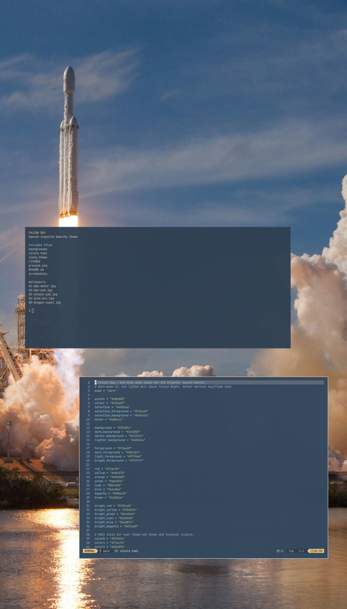
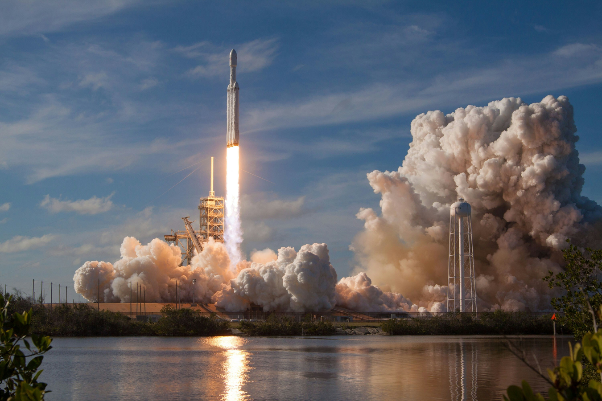

# Falcon Day — Omarchy theme

A dusk-slate Omarchy theme paired with brighter SpaceX rocket photography. Warm flame accent (`#e8b080`), slate background (`#35485c`), and five included wallpapers.

## Desktop showcase

Live Omarchy screenshot with the Falcon Day wallpaper, Foot terminal, and Neovim showing the theme palette (portrait monitor; click for full size).

[](screenshots/desktop.png)

Wallpaper alone:



## Install

```sh
omarchy theme install https://github.com/Hank-dev/omarchy-falcon-day-theme.git
# Installs and applies the theme as "falcon-day".
```

To cycle the included wallpapers, run `omarchy theme bg next`. The theme includes `colors.toml`, `icons.theme` (Yaru-blue-dark), `preview.png`, and `backgrounds/`. If the Yaru icon theme is not installed, change `icons.theme` to an installed icon theme.

The darker companion is [Falcon Night](https://github.com/Hank-dev/omarchy-falcon-night-theme).

## Wallpaper gallery and photo credits

Photos by [SpaceX on Unsplash](https://unsplash.com/@spacex), resized for desktop wallpapers. Select a file to view the full picture.

| Wallpaper | Original |
| --- | --- |
| [Day over water](backgrounds/01-day-water.jpg) | [SpaceX / OHOU-5UVIYQ](https://unsplash.com/photos/OHOU-5UVIYQ) |
| [Day at the pad](backgrounds/02-day-pad.jpg) | [SpaceX / uj3hvdfQujI](https://unsplash.com/photos/uj3hvdfQujI) |
| [Sunset pad](backgrounds/03-sunset-pad.jpg) | [SpaceX / tKs_2sBoqAg](https://unsplash.com/photos/tKs_2sBoqAg) |
| [Dusk arc](backgrounds/04-dusk-arc.jpg) | [SpaceX / -p-KCm6xB9I](https://unsplash.com/photos/-p-KCm6xB9I) |
| [Dragon coast](backgrounds/05-dragon-coast.jpg) | [SpaceX / VBNb52J8Trk](https://unsplash.com/photos/VBNb52J8Trk) |

Theme configuration and documentation are MIT-licensed (see LICENSE). The photographs, including the photographic preview, are not covered by the MIT license; they are shared under the [Unsplash License](https://unsplash.com/license). SpaceX and Falcon are trademarks of their respective owners; this is an unofficial community theme.
